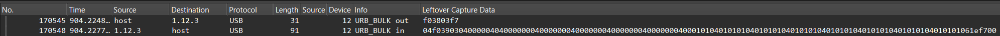
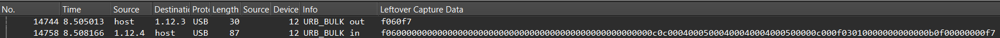
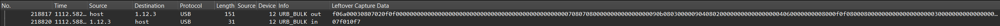
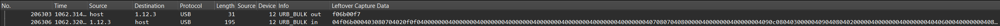
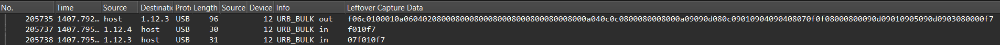
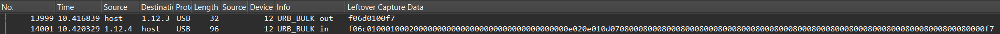

# PreSonus StudioLive 16.0.2 USB Reverse Engineering

This documentation is work-in-progress and provided as-is.  
I tried to optimize for information-density while still retaining some kind of clarity.  
Thus, some things might only make sense if you're already familiar with this mixer / USB in general.  
I hope it's helpful nonetheless.

## USB Protocol
Through looking at the USB traffic captured by Wireshark, while fiddling with the mixer controls / Universal Control PC software, I made the following conclusions:

### Request
The Universal Control application sends commands to the mixer via vendor defined USB control requests on endpoint 3.  
They follow the pattern `F0 <command> F7`.  

### Response  
- Starts with `04` or `07` depending on the length of the following payload (see "chunking" below)
- Always ends in `F7` (sometimes there are a few null bytes after the last byte though).  
-  Appears to have some kind of chunking.  
  - The chunks are 4 bytes in length.
  - The first byte is the chunk flags (?) followed by 3 data bytes.
  - Chunk flags (bitfield): `04`: always set, `02`: last chunk, `01`: single chunk?
- (It seems to repeat the same message without chunking on endpoint 4?)
-  Many values seem to follow some kind of split-nibble encoding.  
  The actual value of e.g. `AB` gets transferred as `0A 0B`.  

### Commands

#### `38 03` General Status Request?
  
This request gets sent periodically roughly every 40ms.

Response:
 | Offset | Example       | Description                                                                                                                                                                        |
 | ------ | ------------- | ---------------------------------------------------------------------------------------------------------------------------------------------------------------------------------- |
 | 00     | `39 03`       | Command (but 0x39)                                                                                                                                                                 |
 | 02     | `00`          | ?                                                                                                                                                                                  |
 | 03     | `00`          | Selected [Channel](#channels)                                                                                                                                                      |
 | ...    |               |                                                                                                                                                                                    |
 | 10     | `00 08 01 00` | [Channel](#channels) State Changed Notification  Bitfield: `00 00 00 01`: Ch1 `00 00 00 02`: Ch2 `00 00 00 04`: Ch3 `00 00 00 08`: Ch4 `00 00 01 00`: Ch5 ... |
 | 14     | `00`          | `01`: FXA State Changed (=> `6D 03 00`)                                                                                                                                            |
 | 15     | `00`          | `01`: FXB State Changed (=> `6D 03 01`)                                                                                                                                            |
 | 16     | `00`          | `01`: GEQ State Changed (=> `6D 01`)                                                                                                                                               |
 | 17     | `00`          | `01`: Fader Positions Changed (=> `6E`)                                                                                                                                            |
 | 18     | `00`          | `01`: System Settings Changed (=> `60`)                                                                                                                                            |
 | ...    |               |                                                                                                                                                                                    |
 | 21-33  | `01`          | **Channel Level Meters** Min: `01`, Max: `21`                                                                                                                                   |
 | 34-41  | `01`          | More Level Meters?                                                                                                                                                                 |
 | 42     | `01 01`       | Main Level Meter (L/R)                                                                                                                                                             |
 | 44     | `1E`          | ?                                                                                                                                                                                  |

#### `53` MIDI Control Write
See below

#### `54` MIDI Control Read
MIDI Settings in the "System" page

MIDI channels 1-16 are transferred as `00`-`0F`.
MIDI control channels 0-127 are transferred as `00 00` - `07 0F` (see [split-nibble](#split-nibble)).

Response:
 | Offset | Example | Description                         |
 | ------ | ------- | ----------------------------------- |
 | 00     | `54`    | Command                             |
 | 01     | `00`    | ?                                   |
 | 02     | `01`    | MIDI Control On                     |
 | 03     | `00 00` | Levels Channel                      |
 | 05     | `00 01` | Scene Recall Channel                |
 | 07     | `00 02` | FXA Recall Channel                  |
 | 09     | `00 03` | FXB Recall Channel                  |
 | 11     | `00 00` | Main Level Control Channel          |
 | 13     | `00 00` | FXA Level Control Channel           |
 | 15     | `00 00` | FXB Level Control Channel           |
 | 17     | `00 00` | FXA Mute Control Channel            |
 | 19     | `00 00` | FXB Mute Control Channel            |
 | 25     | `01`    | ? (only present on read, not write) |

 
#### `60` System Read
  

Some stuff from the "System Settings" page and some other stuff from the buttons/knobs on the right.

Response:
 | Offset | Example | Description                                                                                               |
 | ------ | ------- | --------------------------------------------------------------------------------------------------------- |
 | 00     | `60`    | Command (but 0x6C)                                                                                        |
 | ...    |         |                                                                                                           |
 | 25     | `0D 0C` | Monitor Level                                                                                             |
 | 27     | `08 00` | Phones Level                                                                                              |
 | ...    |         |                                                                                                           |
 | 31     | `00 04` | FXA Level                                                                                                 |
 | 33     | `00 04` | FXB Level                                                                                                 |
 | 35     | `00 04` | Solo Level                                                                                                |
 | ...    |         |                                                                                                           |
 | 41     | `0C`    | Bitfield: `04`: FXA Pre2/Post `08`: FXB Pre2/Post                                                   |
 | 42     |         | ?                                                                                                         |
 | 43     | `0F`    | Bitfield: `01`: Aux1 Pre2/Post `02`: Aux2 Pre2/Post `04`: Aux3 Pre2/Post `08`: Aux4 Pre2/Post |
 | 44     | `03`    | Bitfield: `01`: Talkback Aux1-2 `02`: Talkback Aux3-4                                               |
 | 45     | `01`    | Bitfield: `01`: Solo PFL (0: AFL) `08`: TALK                                                        |
 | 46     | `04`    | Bitfield: `02`: Monitor Main `04`: Monitor Solo `08`: Monitor Digital                            |
 | ...    |         |                                                                                                           |
 | 49     | `03 0C` | `03 0C`: FXB Aux1-4                                                                                       |
 | 51     | `0F`    | `0F`: FXA Aux1-4                                                                                          |
 | 52     | `00`    | Recalling Bitfield: `01`: Mute `02`: FX `04`: GEQ `08`: Pots                                  |
 | 53     | `00`    | Recalling Bitfield: `01`: Assigns `02`: EQ&Dyn `04`: Aux Mix `08`: Faders                     |
 | ...    |         |                                                                                                           |
 | 57     | `00`    | ? (only present on read, not write)                                                                       |

#### `6A xx` Channel State Write
  
On writes, no "chunking" is applied, it's simply the same data as in the Channel State Read command (see below).

#### `6B xx` Channel State Read
  
Reads the state of channel xx (see [Channels](#channels) below for the mapping).  
The software only requests this after detecting a "Channel State Changed" in the "General Status Request".  
It also follows the "[chunking](#chunking)" mentioned above.  

All two-byte values below are [split-nibble encoded](#split-nibble).

Response: 
 | Offset | Example | Description                                                                                            |
 | ------ | ------- | ------------------------------------------------------------------------------------------------------ |
 | 00     | `6B`    | Command                                                                                                |
 | 01     | `00`    | [Channel](#channels)                                                                                   |
 | 02     | `03 08` | Main Level (fader)                                                                                     |
 | 04     | `07 02` | Pan                                                                                                    |
 | 06     | `0F 0F` | Pan (when linked, same value)                                                                                                     |
 | 08     | `00 00` | Aux1 Level                                                                                             |
 | 10     | `00 00` | Aux2 Level                                                                                             |
 | 12     | `00 00` | Aux3 Level                                                                                             |
 | 14     | `00 00` | Aux4 Level                                                                                             |
 | ...    |         |                                                                                                        |
 | 28     | `00 00` | FXA Level                                                                                              |
 | 30     | `00 00` | FXB Level                                                                                              |
 | 32     | `08 00` | Aux1/2 Pan (when linked)                                                                               |
 | 34     | `08 00` | Aux3/4 Pan (when linked)                                                                               |
 | ...    |         |                                                                                                        |
 | 44     | `09 0C` | HPF Frequency                                                                                          |
 | 46     | `08 03` | EQ Low Frequency                                                                                       |
 | 48     | `00 00` | ?                                                                                                      |
 | 50     | `09 04` | EQ Mid Frequency                                                                                       |
 | ...    |         |                                                                                                        |
 | 62     | `04 06` | EQ Low Gain                                                                                            |
 | 64     | `00 00` | ?                                                                                                      |
 | 66     | `00 00` | EQ Mid Gain                                                                                            |
 | 68     | `08 00` | ?                                                                                                      |
 | 70     | `0F 0F` | Compressor Threshold                                                                                   |
 | 72     | `08 00` | Compressor Ratio                                                                                       |
 | 74     | `08 00` | Compressor Response                                                                                    |
 | 76     | `00 00` | ?                                                                                                      |
 | 78     | `00 00` | Compressor Gain                                                                                        |
 | ...    |         |                                                                                                        |
 | 84     | `00 00` | Gate                                                                                                   |
 | ...    |         |                                                                                                        |
 | 106    | `00`    | Bitfield: `01`: HPF On                                                                              |
 | 107    | `00`    | Bitfield: `08`: Gate On                                                                             |
 | 108    | `0A`    | Bitfield: `02`: Compressor On `04`: Compressor Auto `08`: EQ High On                          |
 | 109    | `00`    | Bitfield: `02`: EQ Low On `08`: EQ High On                                                       |
 | 110    | `00`    | Bitfield: `01`: EQ Low Shelf On `04`: EQ Mid Hi Q `08`: EQ High Shelf On                      |
 | 111    | `05`    | Bitfield: `01`: Phantom Power On `02`: USB Audio Input On `04`: Polarity `08`: Digital Out |
 | 112    | `06`    | Bitfield: `01`: Mute `02`: Solo `04`: Link                                                    |
 | ...    |         |                                                                                                        |
 | 121    | `00`    | ?                                                                                                      |

#### `6C 01 xx` GEQ Write
  
Graphic equalizer configuration write.  
Contains all 31 band gain values just one after another.
Mixer responds with `10` (on success?).

Payload:
 | Offset | Example | Description                       |
 | ------ | ------- | --------------------------------- |
 | 00     | `6C`    | Command (but 0x6C)                |
 | 01     | `01 00` | ?                                 |
 | 03     | `01`    | EQ On                             |
 | 04-64  | `08 00` | Band 1-31 Gain (-16.0 to +15.8dB) |
 | 65     | `00`    | ?                                 |

GEQ Bands (Hz):  

#### `6D 01 xx` GEQ Read
  

Graphic Equalizer Read. Payload formatted exactly like "write" above.

#### `6C 03 xx` FX Write

#### `6D 03 xx` FX Read

#### `6E` Fader Position Read
  
Reads all fader positions.  
The software only requests this after detecting a "Fader Positions Changed" in the "General Status Request".  
Fader position is one byte `04`-`FF`, but the nibbles spread across two bytes, big endian.

Response:
 | Offset | Example | Description                                         |
 | ------ | ------- | --------------------------------------------------- |
 | 00     | `6E`    | Command                                             |
 | 01-31  | `00 04` | Fader Position Ch1-Aux4 (see [channels](#channels)) |
 | 33     | `0F 0F` | Fader Position Main                                 |
 | 35     | `00 05` | FXA Knob                                            |
 | 37     | `00 05` | FXB Knob                                            |
 | 39     | `00 00` | ?                                                   |
 | 41     | `06 01` | ?                                                   |

#### `6F` System Write
See [System Read](#60-system-read).

### Channels
- `00-07`: Channels 1 - 8
- `08-0B`: Channels 9/10 - 15/16 (stereo channels)
- `0C-0F`: Aux 1-4
- `10`: Main
- `11-12`: FXA/FXB